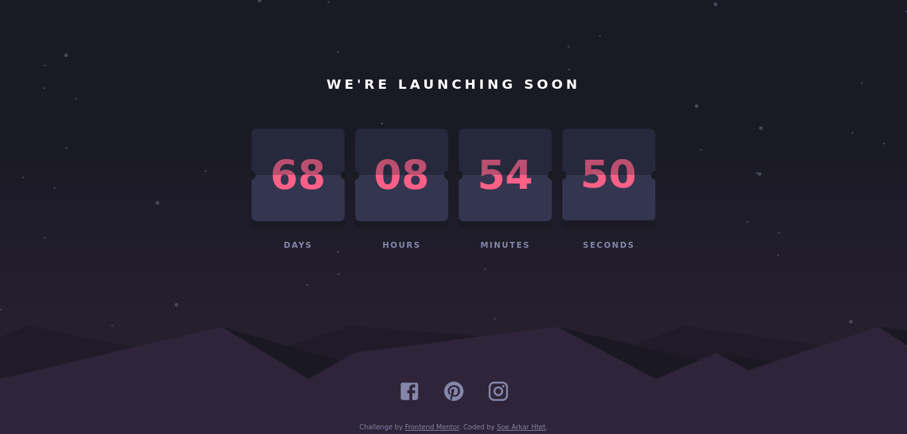

# Frontend Mentor - Launch countdown timer solution

This is a solution to the [Launch countdown timer challenge on Frontend Mentor](https://www.frontendmentor.io/challenges/launch-countdown-timer-N0XkGfyz-). Frontend Mentor challenges help you improve your coding skills by building realistic projects. 

## Table of contents

- [Overview](#overview)
  - [The challenge](#the-challenge)
  - [Screenshot](#screenshot)
  - [Links](#links)
- [My process](#my-process)
  - [Built with](#built-with)
  - [Useful resources](#useful-resources)
- [Author](#author)
- [Acknowledgments](#acknowledgments)

## Overview

### The challenge

Users should be able to:

- See hover states for all interactive elements on the page
- See a live countdown timer that ticks down every second (start the count at 14 days)
- **Bonus**: When a number changes, make the card flip from the middle

### Screenshot

### Links

- [Solution URL](https://github.com/SArkar-Htet/launch-coundown-timer)
- [Live Site URL](https://sarkar-htet.github.io/launch-coundown-timer/)

## My process

### Built with

- Semantic HTML5 markup
- CSS custom properties
- CSS animation
- Flexbox
- Mobile-first workflow
- SCSS
- [React](https://reactjs.org/) - JS library
- [Material Icons](https://mui.com/components/material-icons/)

### Useful resources

- [Create React App](https://create-react-app.dev) - This website helped me to know how to create a react app and how to deploy it on github pages.
- [How TO - JavaScript Countdown Timer
](https://www.w3schools.com/howto/howto_js_countdown.asp) - This helped me to know how to create a countdown timer using JS.
- [React Flip Clock](codepen.io/rufusmedia/) - This is an awesome pen which helped me to create flip card animation.

## Author

- Frontend Mentor - [@SArkar-Htet](https://www.frontendmentor.io/profile/SArkar-Htet)
- Twitter - [@soearkarhtet](https://twitter.com/soearkarhtet)
- Facebook - [Soe Arkar Htet](https://www.facebook.com/soearkar.htet.526/)

## Acknowledgments

Firstly, I’m very thankful to my senior [Ayar Hlaine](https://github.com/ayarhlaine) who’s teaching and helping me in web development environments. Please accept my deepest thanks. I learned some css styles for card on [@claudiabdm](https://www.frontendmentor.io/profile/claudiabdm) solution. Thank you, [@claudiabdm](https://www.frontendmentor.io/profile/claudiabdm). And then, [this awesome pen](https://codepen.io/liborgabrhel/pen/JyJzjb) helped me to create flip animation so I’m very thank to owner of this pen.